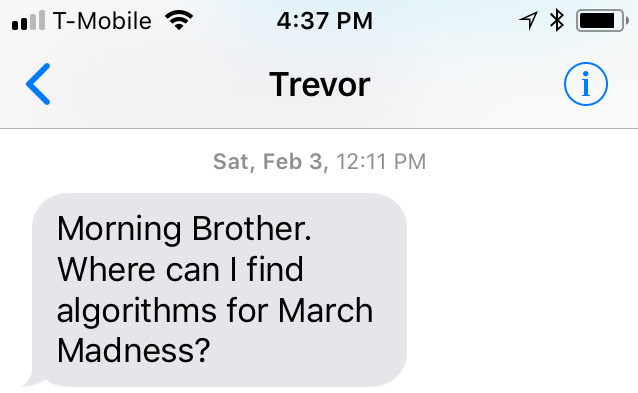
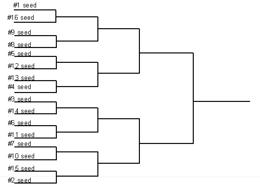
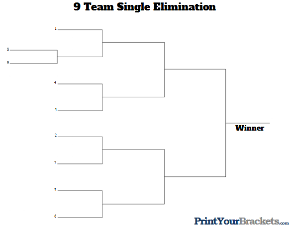
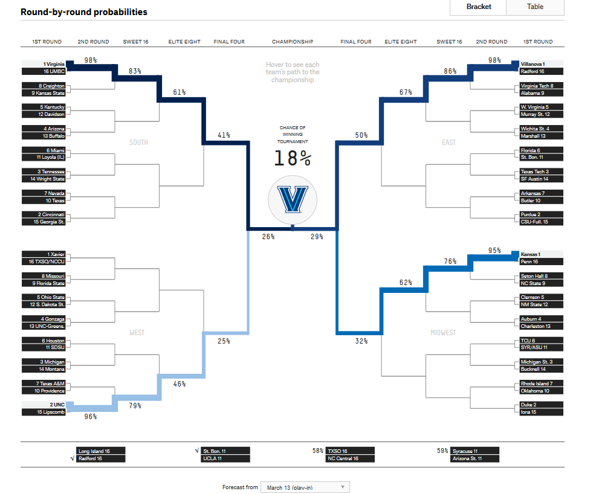
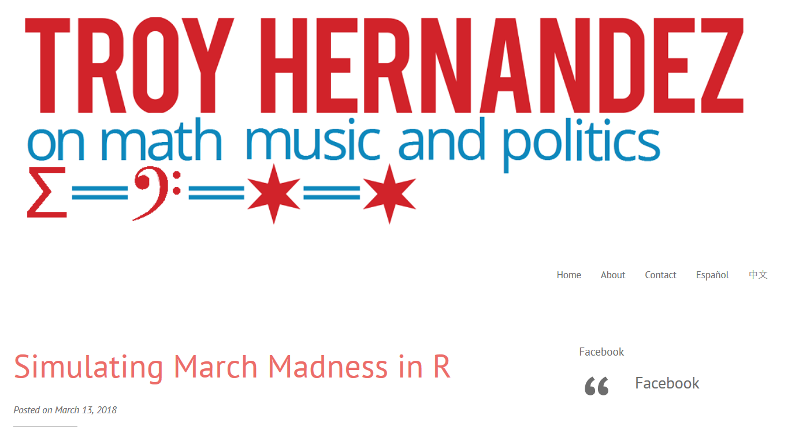
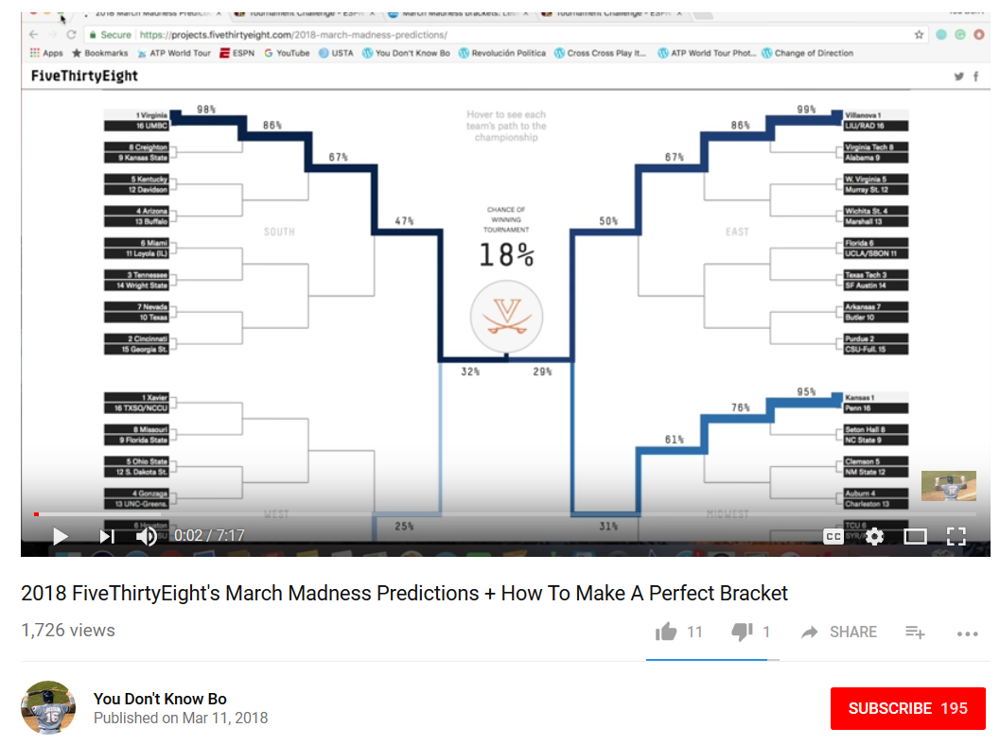
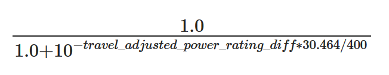

```{r setup, include=FALSE}
knitr::opts_chunk$set(echo = TRUE)
```

# Outline

1. Story
2. Code
3. Results
4. Drama

# Story

## My Brother {.flexbox .vcenter .smaller}


## My Brother... and his family trip to Vegas {.flexbox .vcenter .smaller}



## rstats on reddit {.flexbox .vcenter .smaller}


## rstats on reddit {.flexbox .vcenter .smaller}


## FiveThirtyEight 2017 {.flexbox .vcenter .smaller}

https://projects.fivethirtyeight.com/2017-march-madness-predictions/


## FiveThirtyEight 2018 {.flexbox .vcenter .smaller}

https://projects.fivethirtyeight.com/2018-march-madness-predictions/


## FiveThirtyEight 2018 Data {.flexbox .vcenter .smaller}

https://projects.fivethirtyeight.com/march-madness-api/2018/fivethirtyeight_ncaa_forecasts.csv


# Code

## The Data {.vcenter .smaller}

```{r}
dat <- read.csv("fivethirtyeight_ncaa_forecasts_2018.csv", stringsAsFactors = FALSE)
dat <- dat[which(dat$gender == "mens" &
                     dat$forecast_date == "2018-03-12"), ]
head(dat)
```

## The Data {.vcenter .smaller}

```{r}
dat <- read.csv("fivethirtyeight_ncaa_forecasts_2018.csv", stringsAsFactors = FALSE)
dat <- dat[which(dat$gender == "mens" &
                     dat$forecast_date == "2018-03-12"), ]
dat18 <- dat
dat18[, 5:10] <- dat[, 5:10] / dat[, 4:9]
head(dat18)
```

## Tournaments {.flexbox .vcenter .smaller}



## Ranked Tournament Structure

```{r}
Tournament.Round <- function(mat.big = mat.16, rd = "rd2_win"){
  vec.small <- c()
  for(i in 1:(nrow(mat.big) / 2)){
    ind <- c(i, nrow(mat.big) + 1 - i)
    temp <- sample(x = ind, size = 1, prob = mat.big[ind, rd])
    vec.small <- c(vec.small, temp)
  }
  mat.small <- mat.big[vec.small, ]
}
```

## Pig Tails {.flexbox .vcenter .smaller}



## NCAA Pig Tails {.flexbox .vcenter .smaller}



## First Four {.vcenter .smaller}

```{r}
mat.17 <- dat18[which(dat18$team_region == "Midwest" &
                          dat18$gender == "mens" &
                          dat18$forecast_date == "2018-03-12"),]

first.four <- which(mat.17$team_seed == "11a" | mat.17$team_seed == "11b")
mat.16 <- rbind(mat.17[-first.four, ],
                mat.17[sample(x = first.four, size = 1,
                              prob = mat.17[first.four, "rd1_win"]), ])
mat.16[16, "team_seed"] <- "11"
mat.16[, "team_seed"] <- as.numeric(mat.16[, "team_seed"])
mat.16 <- mat.16[order(mat.16$team_seed), ]
tail(mat.16[, -c(1:12)])
```

## First Four {.vcenter .smaller}

```{r}
First.Four <- function(region, mat.17){
  if(region == "Midwest"){
    first.four <- which(mat.17$team_seed == "11a" | mat.17$team_seed == "11b")
    mat.16 <- rbind(mat.17[-first.four, ],
                    mat.17[sample(x = first.four, size = 1,
                                  prob = mat.17[first.four, "rd1_win"]), ])
    mat.16[16, "team_seed"] <- "11"
    mat.16[, "team_seed"] <- as.numeric(mat.16[, "team_seed"])
    mat.16 <- mat.16[order(mat.16$team_seed), ]
  }
  if(region == "South"){
    mat.16 <- mat.17
    mat.16[, "team_seed"] <- as.numeric(mat.16[, "team_seed"])
    mat.16 <- mat.16[order(mat.16$team_seed), ]
  }

  if(region == "East"){
    first.four <- which(mat.17$team_seed == "16a" | mat.17$team_seed == "16b")
    mat.17 <- rbind(mat.17[-first.four, ],
                    mat.17[sample(x = first.four, size = 1,
                                  prob = mat.17[first.four, "rd1_win"]), ])
    mat.17[17, "team_seed"] <- "16"
    first.four <- which(mat.17$team_seed == "11a" | mat.17$team_seed == "11b")
    mat.16 <- rbind(mat.17[-first.four, ],
                    mat.17[sample(x = first.four, size = 1,
                                  prob = mat.17[first.four, "rd1_win"]), ])
    mat.16[16, "team_seed"] <- "11"
    
    mat.16[, "team_seed"] <- as.numeric(mat.16[, "team_seed"])
    mat.16 <- mat.16[order(mat.16$team_seed), ]
  }
  if(region == "West"){
    first.four <- which(mat.17$team_seed == "16a" | mat.17$team_seed == "16b")
    mat.16 <- rbind(mat.17[-first.four, ],
                    mat.17[sample(x = first.four, size = 1,
                                  prob = mat.17[first.four, "rd1_win"]), ])
    mat.16[16, "team_seed"] <- "16"
    mat.16[, "team_seed"] <- as.numeric(mat.16[, "team_seed"])
    mat.16 <- mat.16[order(mat.16$team_seed), ]
  }
  mat.16
}
```

## Regional Simulation {.vcenter .smaller}

```{r}
Region.Simulation <- function(region = "Midwest", dat = dat18){
  mat.17 <- dat[which(dat$team_region == region &
                          dat$gender == "mens" &
                          dat$forecast_date == "2018-03-12"),]
  mat.16 <- First.Four(region = region, mat.17 = mat.17)
  mat.8 <- Tournament.Round(mat.16, rd = "rd2_win")
  mat.4 <- Tournament.Round(mat.8, rd = "rd3_win")
  mat.2 <- Tournament.Round(mat.4, rd = "rd4_win")
  mat.1 <- Tournament.Round(mat.2, rd = "rd5_win")
  list(First_Four = mat.16[c(11, 16), "team_name"],
       First_Round = mat.8[, "team_name"],
       Second_Round = mat.4[, "team_name"],
       Regional_Semis = mat.2[, "team_name"],
       Regional_Final = mat.1[, c("team_name", "rd6_win", "rd7_win")])
}
```

## Regional Simulation

```{r}
Region.Simulation(region = "Midwest")$Regional_Final
```

## March Madness Bracket {.flexbox .vcenter .smaller}


## March Madness Simulation {.vcenter .smaller}

```{r}
March.Madness.Simulation <- function(dat = dat){
  midwest <- Region.Simulation(region = "Midwest", dat = dat)
  east <- Region.Simulation(region = "East", dat = dat)
  west <- Region.Simulation(region = "West", dat = dat)
  south <- Region.Simulation(region = "South", dat = dat)
  reg1 <- sample(x = c("east", "west"), size = 1,
                 prob = c(east$Regional_Final$rd6_win,
                          west$Regional_Final$rd6_win))
  National_Semi1 <- get(reg1)$Regional_Final
  reg2 <- sample(x = c("midwest", "south"), size = 1,
                 prob = c(midwest$Regional_Final$rd6_win,
                          south$Regional_Final$rd6_win))
  National_Semi2 <- get(reg2)$Regional_Final
  National_Champ <- sample(x = c(National_Semi1$team_name,
                                 National_Semi2$team_name),
                          size = 1,
                          prob = c(National_Semi1$rd7_win,
                                   National_Semi2$rd7_win))
  midwest$Regional_Final <- midwest$Regional_Final$team_name
  east$Regional_Final <- east$Regional_Final$team_name
  west$Regional_Final <- west$Regional_Final$team_name
  south$Regional_Final <- south$Regional_Final$team_name
  
  list(Midwest = midwest, East = east, West = west, South = south,
       National_Semi = c(National_Semi1$team_name, National_Semi2$team_name),
       National_Champ = National_Champ)
}
```


# Results

## Simulate!

Simulate 10,000 March Madness Tournaments.

```{r, cache=TRUE}
nat.champ.vec <- unlist(March.Madness.Simulation(dat = dat18))
nat.champ.mat <- matrix("", nrow = 10000, ncol = length(nat.champ.vec))
colnames(nat.champ.mat) <- names(nat.champ.vec)

for(i in 1:10000){
  set.seed(i)
  nat.champ.mat[i, ] <- unlist(March.Madness.Simulation(dat = dat18))
}
nat.champ.mat <- as.data.frame(nat.champ.mat)
```

## Winner Winner Chicken Dinner {.vcenter .smaller}

```{r}
tbl <- sort(table(nat.champ.mat$National_Champ), decreasing = TRUE)
tbl
```

## Outcomes

Villanova winning `r round(tbl[1]/100, 1)`% of the time

Virginia winning `r round(tbl[2]/100, 1)`% of the time

538's predictions:

```{r}
dat[1:2, c(13, 10)]
```

# Drama

## 538's predictions on Monday, March 12th

```{r}
dat[1:2, c(13, 10)]
```

## My blog published on Tuesday, March 13th {.flexbox .vcenter .smaller}



## 538's predictions on Wednesday, March 14th

```{r}
dat <- read.csv("fivethirtyeight_ncaa_forecasts_20180314.csv", stringsAsFactors = FALSE)
dat <- dat[which(dat$gender == "mens" &
                     dat$forecast_date == "2018-03-13"), ]
dat[1:2, c(13, 10)]
```

## My Brother... and his family trip to Vegas {.flexbox .vcenter .smaller}


## 538's predictions on Monday, March 12th from Wednesday, March 14th

```{r}
dat <- read.csv("fivethirtyeight_ncaa_forecasts_20180314.csv", stringsAsFactors = FALSE)
dat <- dat[which(dat$gender == "mens" &
                     dat$forecast_date == "2018-03-12"), ]
dat[1:2, c(13, 10)]
```

## Proof {.flexbox .vcenter .smaller}



https://www.youtube.com/watch?v=TR5bAzK-aUw

## How Our March Madness Predictions Work {.flexbox .vcenter}

https://fivethirtyeight.com/features/how-our-march-madness-predictions-work/

First:


Then:

> We calculate the chance of any team beating another ... based on the difference between the two teams’ travel-adjusted power ratings:



## How Our March Madness Predictions Work {.flexbox .vcenter}

https://fivethirtyeight.com/features/how-our-march-madness-predictions-work/

Finally:

> the chance of a team reaching a given round is the chance they reach the previous round, multiplied by their chance of beating any possible opponent in the previous round, weighted by their likelihood of meeting each of those opponents.

## ¯/\_(ツ)_/¯

Predictions could've changed for many reasons

- Injury to VA's guard and version control for data problems
- My blog

## ¯\\_(ツ)_/¯

Predictions could've changed for many reasons

- Injury to VA's guard and version control for data problems
- **My blog**

# The End

Questions?

¿Preguntas?

问题吗
